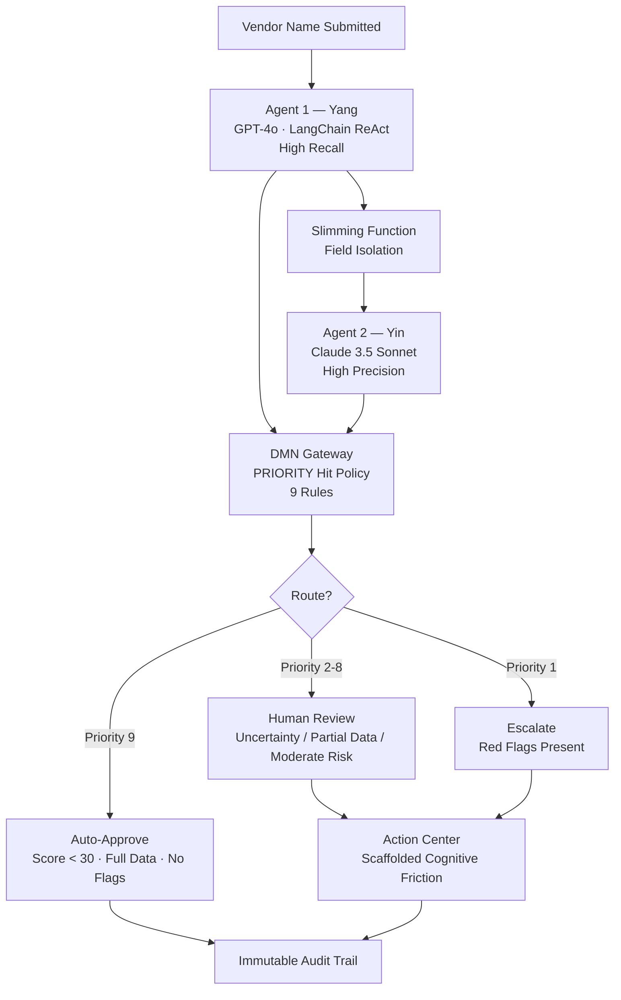

# Third-Party Risk Gate

**Verifiable AI Compliance for the EU AI Act — Adversarial Multi-Agent Systems + BPMN + Human-in-the-Loop Safeguards**

> A deterministic, auditable pipeline that automates third-party vendor risk evaluation using heterogeneous AI agents, structured decision logic (DMN), and enforced human oversight — designed from the ground up to satisfy EU AI Act Articles 6–15.

**UiPath AgentHack 2026 · Track 2 (Maestro / BPMN)**

---

## Table of Contents

- [The Problem](#the-problem)
- [The Solution](#the-solution)
- [Architecture](#architecture)
- [Repository Layout](#repository-layout)
- [Key Design Decisions](#key-design-decisions)
- [EU AI Act Compliance](#eu-ai-act-compliance)
- [Quick Start](#quick-start)
- [Test Matrix](#test-matrix)
- [Current Status](#current-status)
- [Team](#team)
- [License](#license)

---

## The Problem

Enterprise procurement teams evaluate **500+ vendors per month** using manual processes that take **30–45 days per assessment** and require **40+ hours of analyst time**. That translates to a large recurring analyst cost.

Existing tools — OneTrust, SecurityScorecard, BitSight, UpGuard — excel at data gathering or questionnaire routing. But none execute **deterministic, adversarial AI verification** bound by a BPMN orchestration engine to generate **immutable, EU AI Act-compliant conformity assessments**.

Meanwhile, research indicates human reviewers frequently rubber-stamp erroneous AI recommendations due to algorithmic conformity (Liel & Zalmanson, JMIS, 2025). Simply placing a human in the loop is a weak safeguard on its own.

---

## The Solution

Third-Party Risk Gate replaces slow manual evaluations with AI-assisted assessments while maintaining defensible human oversight. The system does not just automate — it **verifies adversarially**, **routes deterministically**, and **audits immutably**.

| Metric | Manual Process | This System (design target) |
|---|---|---|
| Time per assessment | 30–45 days | Minutes |
| Human effort | 40+ analyst hours | Review only the cases that need it |
| Audit trail | Manual, mutable | Automatic, append-only, immutable |

> Note: the cost/ROI figures in early planning materials were illustrative estimates and have not been independently benchmarked. Treat them as projections, not measured results.

---

## Architecture



### Flow Summary

1. **Agent 1 (Hypothesis / Yang)** — GPT-4o via LangChain gathers wide-angle intelligence with high recall.
2. **Slimming Function** — Strips reasoning, narrative, and internal flags; passes only bare assertions to Agent 2.
3. **Agent 2 (Evidence / Yin)** — Claude 3.5 Sonnet independently verifies every red flag with high precision.
4. **DMN Gateway** — 9-rule PRIORITY decision table routes deterministically.
5. **Human-in-the-Loop** — Action Center enforces cognitive friction for review/escalation cases.
6. **Audit Trail** — Every decision logged immutably with full provenance.

---

## Repository Layout

```
vendor-risk-orchestrator/
├── agent/                  Python intelligence layer — tested, working
│   ├── models.py               Pydantic data contracts
│   ├── mock_server.py          FastAPI mock with 11 deterministic scenarios
│   ├── agent1.py               Agent 1 (GPT-4o, LangChain) + slimming function
│   ├── agent1_prompt.py        Agent 1 system prompt
│   ├── agent2_prompt.py        Agent 2 prompt (for UiPath Agent Builder)
│   ├── agent2_mock.py          Agent 2 mock auditor
│   ├── dmn_engine.py           DMN PRIORITY gateway — 9 rules, pure Python
│   ├── audit_logger.py         Immutable audit trail (JSONL)
│   ├── pipeline.py             Orchestrator: Agent1 → slim → Agent2 → DMN → audit
│   ├── test_matrix.py          API-level tests (11 cases)
│   ├── test_pipeline.py        End-to-end tests (11 cases)
│   ├── live_test_opencorporates.py  Live API integration check
│   └── requirements.txt
├── maestro/                UiPath Maestro BPMN process + DMN table (in progress)
├── ui/                     Action Center form / cognitive-friction UI reference
├── docs/
│   ├── PROJECT_OVERVIEW.md     Full architecture, compliance matrix, academic foundation
│   ├── demo_script.md          Demo walkthrough + Q&A prep
│   └── AI_CODING_JOURNAL.md    Development journal (hackathon submission)
├── requirements.txt
├── .env.example
├── LICENSE
└── README.md
```

The Python modules in `agent/` import each other as siblings, so they are kept flat in a single directory. The flat files map onto the logical architecture layers (agents / DMN / audit / pipeline) as described above.

---

## Key Design Decisions

### 1. Heterogeneous Adversarial Verification
Agent 1 (GPT-4o) and Agent 2 (Claude 3.5 Sonnet) use different providers, preventing the shared-bias reinforcement documented in cooperative multi-agent systems.

### 2. Structured Information Compartmentalization
Agent 2 receives only `vendor_name`, `risk_score`, `red_flags`, `data_sources_used`, `data_completeness`. All reasoning and internal flags are stripped, preventing anchoring bias.

### 3. DMN PRIORITY Hit Policy
9 rules in strict priority order — any red flag escalates regardless of score (Priority 1); a clean low-risk full-data vendor auto-approves (Priority 9); everything in between routes to human review. Thresholds are adjustable without touching backend code.

### 4. Predictive Multiplicity Detection
Agent 1 evaluates at temperature 0.0 and 0.7. If scores diverge by more than 15, a multiplicity flag forces human review.

### 5. Scaffolded Cognitive Friction
The Action Center UI rejects binary Approve/Reject. Reviewers must select a justification code and write a minimum-length rationale before overriding the AI recommendation.

### 6. Adversarial Robustness
If no data source returns information about a vendor, a `new_entity_no_history` flag routes deterministically to human investigation, mitigating entity-spoofing.

### 7. Chain-of-Thought Ordering
The Pydantic schema places `reasoning` before `risk_score`, forcing justification before the score is produced.

---

## EU AI Act Compliance

Every feature maps to a statutory obligation. Full detail in [`docs/PROJECT_OVERVIEW.md`](docs/PROJECT_OVERVIEW.md).

| Article | Obligation | System Feature |
|---|---|---|
| Art. 9 | Continuous risk management | DMN table with PRIORITY hit policy; adjustable thresholds |
| Art. 10 | Data quality & governance | `data_completeness` enum; Pydantic validation; country tracking |
| Art. 11 | Technical documentation | This repo + architecture docs |
| Art. 12 | Record-keeping | Immutable append-only audit trail capturing every state transition |
| Art. 13 | Transparency | Action Center brief: confidence, evidence, red flags, contestation |
| Art. 14 | Human oversight | BPMN user task with high-friction UI; mandatory override justification |
| Art. 15 | Accuracy & robustness | Error handling, retry loops, LLM fallback, multiplicity evaluation |

**GDPR note:** transmitting vendor names to external LLM APIs makes those providers data processors under GDPR Art. 28; a deployment would need signed DPAs with each provider.

---

## Quick Start

The test suites require **LangChain installed** and the **mock server running first**.

```bash
cd agent
pip install -r requirements.txt        # installs LangChain + FastAPI etc.
python mock_server.py &                 # start mock API on :8000
python test_matrix.py                   # API-level tests
python test_pipeline.py                 # end-to-end pipeline tests
```

To run with real LLMs instead of the mock:

```bash
export OPENAI_API_KEY=your-key
export ANTHROPIC_API_KEY=your-key
export USE_REACT_AGENT=true
python pipeline.py
```

---

## Test Matrix

11 cases covering every routing path, failure mode, and edge case (happy path, sanctions escalation, API failure, partial data, boundary score, conflicting data, hallucinated vendor, predictive multiplicity, DMN priority override, LLM outage, and a BPMN-side timer case).

```
======================================================================
  SUMMARY: 10 PASSED | 0 FAILED | 1 SKIPPED
======================================================================
```

The 1 skipped case is the 48-hour SLA timer, which is exercised on the BPMN/Maestro side rather than in Python.

---

## Current Status

| Component | Status |
|---|---|
| Python pipeline (agents, DMN, audit, orchestrator) | Complete and tested — 10/10 passing |
| Mock data server (11 scenarios) | Complete |
| Test suites (API + end-to-end) | Complete |
| UiPath Maestro BPMN process | In progress |
| Agent 2 in UiPath Agent Builder | Prompt ready; not yet wired in UiPath |
| Action Center human-review form | Reference design; not yet built in UiPath |
| Live API integration (OpenCorporates) | Partial — free tier may now require a key; verify before relying on it |

---

## Team

| Member | Role | Scope |
|---|---|---|
| **Swarup** | AI Architecture + Python | Agents, DMN engine, Pydantic contracts, pipeline, audit logger, tests, mock server, documentation |
| **Siddhant** | Platform / UiPath + BPMN | UiPath Cloud, Orchestrator, Maestro BPMN process, Agent 2 in Agent Builder, Action Center form, SLA timers, escalation |

---

## License

MIT — see [LICENSE](LICENSE).
